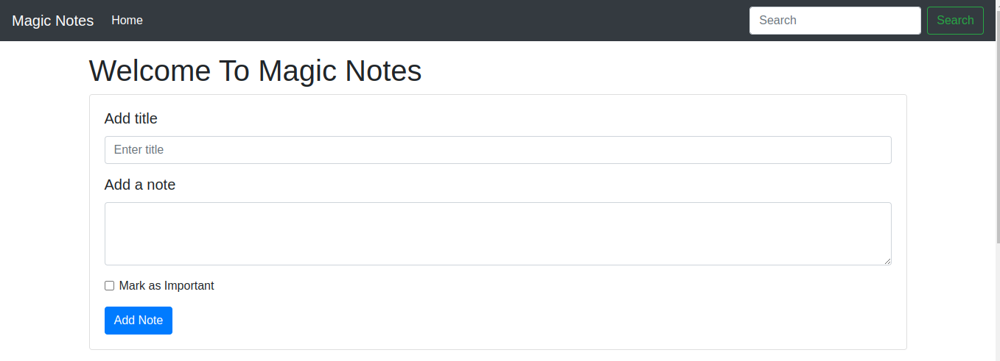
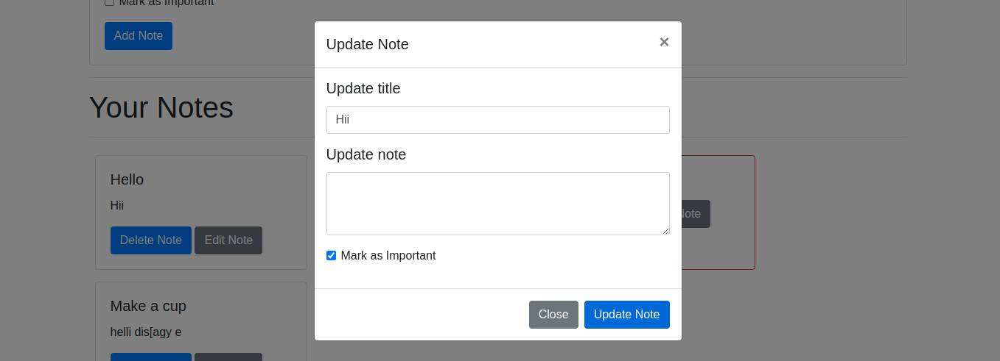
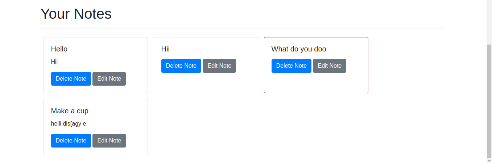
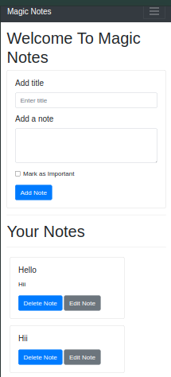

# Magic Notes

Magic Notes is a simple, fully responsive note-taking web application that allows users to add, update, delete, and mark notes as important. The application uses `localStorage` to save the notes in the browser.

## Features

- Add a new note with a title and description.
- Mark notes as important.
- Update existing notes.
- Delete notes.
- Search through notes.
- Notes are saved in `localStorage`.
- Fully responsive design, compatible with all screen sizes.

## Demo










## Usage

### Adding a Note

1. Enter the title and description of the note.
2. (Optional) Check the "Mark as Important" checkbox to mark the note as important.
3. Click on the "Add Note" button.

### Updating a Note

1. Click on the "Edit Note" button of the note you want to update.
2. Update the title and description in the modal.
3. (Optional) Check or uncheck the "Mark as Important" checkbox.
4. Click on the "Update Note" button.

### Deleting a Note

1. Click on the "Delete Note" button of the note you want to delete.

### Searching Notes

1. Enter the search term in the search box. Notes matching the search term will be displayed.

## Installation

To run this project locally:

1. Clone the repository:

    ```bash
    git clone https://github.com/your-username/magic-notes.git
    ```

2. Open the `index.html` file in your web browser.

## Contributing

Contributions are welcome! Please feel free to submit a Pull Request.

## License

This project is licensed under the MIT License.

## Contact

For any questions, please contact:

- Name: M Khalil
- Email: [iammalikkhalil@outlook.com](mailto:iammalikkhalil@outlook.com)

